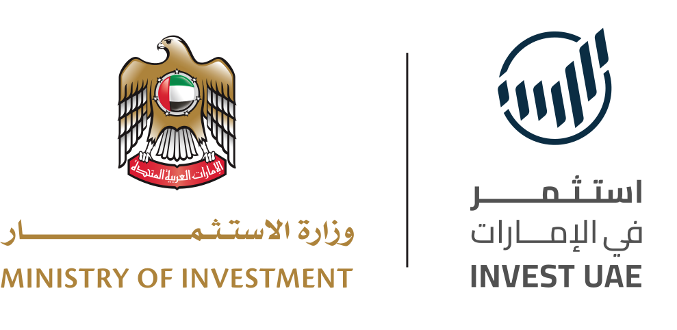

<div align="center">



<h1>Invest UAE · AI Investment Signal Detection</h1>

<p>
  A sovereign-grade signal intelligence platform built for the
  <strong>Ministry of Investment of the United Arab Emirates</strong>.
  It continuously surveils global open sources, detects early investment
  signals, and ranks companies by investability and UAE national-strategy
  alignment, with auditable, compliance-first primitives suitable for
  ministerial use.
</p>

<p>
  <a href="https://frontend-iota-seven-30.vercel.app">
    
  </a>
  
  
  
  
</p>

<p>
  
  
  
  
  
  
  
  
  
</p>

</div>

---

## About the Ministry of Investment

The Ministry of Investment plays a pivotal role in solidifying the UAE's
position as a global investment hub with world-class connectivity to
international markets. By attracting foreign direct investment in critical
sectors and fostering public and private sector collaboration, the
Ministry leverages the UAE's fit-for-purpose, investor-friendly environment
and ambitious economic diversification goals, positioning the nation as a
resilient and forward-looking destination for global investors and
enterprises.

## About Invest UAE

Invest UAE is a platform by the Ministry of Investment dedicated to
enhancing the UAE's investment ecosystem and positioning the UAE as a
leading global investment hub. Under the Ministry's leadership, Invest UAE
aims to attract and facilitate foreign direct investment across multiple
sectors of the UAE's economy and encourage partnerships between global
investors and nations. Its purpose is to create a setting where people,
businesses, and capital can thrive, reinforcing the UAE's position as a
compelling investment destination for all.

---

## The case study

<table>
  <tr>
    <td width="22%"><strong>Background</strong></td>
    <td>The Ministry is exploring the development of an AI-powered investment
    signal detection tool to identify global companies that may be preparing
    to expand internationally, particularly into the UAE or the region. The
    goal is to automatically scan sources such as news articles, press
    releases, interviews, and financial announcements to detect early signals
    of company growth, fundraising, or regional expansion plans. By turning
    large volumes of global information into actionable insights, the tool
    would help investment teams proactively identify high-potential companies
    and generate a daily pipeline of potential investors aligned with the
    UAE's investment priorities.</td>
  </tr>
  <tr>
    <td><strong>Task</strong></td>
    <td>Build a simple prototype that demonstrates how such a tool could
    work. The prototype should scan publicly available sources from the past
    three months to identify companies showing potential investment or
    expansion signals. Output should include a list of companies identified,
    along with the relevant signals detected, supporting sources, and a brief
    explanation of why they may represent a potential investment opportunity.</td>
  </tr>
  <tr>
    <td><strong>What was delivered</strong></td>
    <td>A deployed, production-shape platform that goes far beyond the
    prototype ask. It contains a 6-stage open-source AI agent pipeline,
    a UAE-grade safety taxonomy with 181 automated tests, a 15-connector
    investor workspace with encrypted token vault, full EN and AR
    bilingual UI with RTL layout, append-only audit logging aligned to PDPL
    Article 23, and a 90-day rolling surveillance window over 24 curated
    public news sources.</td>
  </tr>
</table>

---

## Deployments

<table>
  <tr>
    <th align="left">Surface</th>
    <th align="left">URL</th>
    <th align="left">Runtime</th>
    <th align="left">Region</th>
  </tr>
  <tr>
    <td>Public marketing site and signal platform</td>
    <td><a href="https://frontend-iota-seven-30.vercel.app">frontend-iota-seven-30.vercel.app</a></td>
    <td>Vercel Edge, Next.js 16 App Router</td>
    <td>fra1 (Frankfurt)</td>
  </tr>
  <tr>
    <td>Authenticated investor workspace</td>
    <td><a href="https://frontend-iota-seven-30.vercel.app/workspace">/workspace</a></td>
    <td>Vercel Serverless, Auth.js v5</td>
    <td>fra1 (Frankfurt)</td>
  </tr>
  <tr>
    <td>Signal detection API</td>
    <td><a href="https://backend-lyart-three-63.vercel.app/docs">backend-lyart-three-63.vercel.app</a></td>
    <td>Vercel Python, FastAPI + Uvicorn</td>
    <td>fra1 (Frankfurt)</td>
  </tr>
  <tr>
    <td>Database</td>
    <td>Neon project <code>spring-sunset-19058641</code></td>
    <td>PostgreSQL 16, branched</td>
    <td>eu-central-1 (Frankfurt)</td>
  </tr>
</table>

---

## Pipeline architecture

Every article passes through six deterministic stages. Each stage is
independently testable, independently auditable, and produces a structured
output that the next stage consumes.

<table>
  <tr>
    <th width="8%" align="left">Stage</th>
    <th align="left">Name</th>
    <th align="left">Responsibility</th>
    <th align="left">Technology</th>
  </tr>
  <tr>
    <td align="center"><strong>1</strong></td>
    <td>RSS aggregator</td>
    <td>Async fan-out across 24 feeds (18 direct publishers, 6 Arabic-language sources), 90-day rolling window, URL-hash dedup, bounded-concurrency og:image enrichment with user-agent rotation.</td>
    <td><code>httpx</code>, <code>feedparser</code>, <code>lxml</code></td>
  </tr>
  <tr>
    <td align="center"><strong>2</strong></td>
    <td>Entity extraction</td>
    <td>Company names, headquarters, expansion targets, funding amounts, executives. Uses regex patterns, a 50-city MENA and global gazetteer, and a fragment filter that rejects clause-level noise.</td>
    <td>Pure Python, <code>rapidfuzz</code> for dedup</td>
  </tr>
  <tr>
    <td align="center"><strong>3</strong></td>
    <td>Zero-shot classification</td>
    <td>Labels each article as one of 8 signal types (funding, expansion, partnership, launch, regulatory, hiring, m_and_a, executive) with confidence and strength. 60 percent embedding-similarity blend, 40 percent keyword regex.</td>
    <td><code>sentence-transformers</code> optional, hash fallback</td>
  </tr>
  <tr>
    <td align="center"><strong>4</strong></td>
    <td>Safety gate</td>
    <td>Blocks sanctioned entities (OFAC, UN, EU), queues politically-exposed persons for enhanced due diligence, rejects prompt-injection patterns before any LLM call, redacts PII on outgoing signal bodies, refuses regulated-activity queries.</td>
    <td><code>app/safety/*</code></td>
  </tr>
  <tr>
    <td align="center"><strong>5</strong></td>
    <td>Multi-factor scoring</td>
    <td>Investability (signal momentum, funding maturity, sector fit, signal diversity, semantic quality). UAE alignment (geographic presence, expansion intent, strategic sector fit, UAE signal relevance, strategy alignment). Both 0 to 100.</td>
    <td>Heuristic weights aligned to national strategies</td>
  </tr>
  <tr>
    <td align="center"><strong>6</strong></td>
    <td>Additive merge and cache</td>
    <td>Union with previous snapshot. 30-day sliding window on signals, 15 freshest signals per company, 200-company cap sorted by composite score. Disk-backed JSON cache, 6-hour TTL.</td>
    <td>Asyncio lock, file-backed</td>
  </tr>
</table>

The enhancement layer calls Anthropic's Haiku for strict-JSON signal
extraction in batches of 12 articles, and Opus for the 2 to 3 sentence
company thesis. Both calls pass through a single audited chokepoint
(`frontend/lib/ai/client.ts`) that writes an `AuditEntry` for every
invocation with prompt and output hashes only, never the bodies.

---

## Real AI agents in the backend

Five open-source agents drive the pipeline. The Anthropic layer is
optional. Every agent ships as a pure-Python module with a deterministic
fallback path so the system runs offline and produces reproducible output
for forensic review.

<table>
  <tr>
    <th align="left">Agent</th>
    <th align="left">Module</th>
    <th align="left">Capability</th>
    <th align="left">Fallback</th>
  </tr>
  <tr>
    <td>Embedding</td>
    <td><code>app/agents/embedding_agent.py</code></td>
    <td>384-dim semantic vectors for relevance, dedup, and sector similarity against UAE national-strategy anchors.</td>
    <td>Deterministic hash encoder</td>
  </tr>
  <tr>
    <td>Classifier</td>
    <td><code>app/agents/classifier_agent.py</code></td>
    <td>Zero-shot type and strength classification across 8 signal types with a keyword and embedding blend.</td>
    <td>Pure keyword regex</td>
  </tr>
  <tr>
    <td>Entity</td>
    <td><code>app/agents/entity_agent.py</code></td>
    <td>Company names, locations, funding amounts, executives. MENA and global 50-city gazetteer with alias folding.</td>
    <td>Built-in, no model needed</td>
  </tr>
  <tr>
    <td>Scoring</td>
    <td><code>app/agents/scoring_agent.py</code></td>
    <td>Multi-factor investability and UAE alignment scoring aligned to AI Strategy 2031, Net Zero 2050, Operation 300bn, Make it in the Emirates.</td>
    <td>Heuristic weights, no model needed</td>
  </tr>
  <tr>
    <td>Orchestrator</td>
    <td><code>app/agents/orchestrator.py</code></td>
    <td>End-to-end pipeline coordinator. Merges snapshots additively, enforces fragment filters, and preserves original display casing.</td>
    <td>N/A (always runs)</td>
  </tr>
</table>

---

## UAE-grade safety taxonomy

Every signal crossing the pipeline passes through a deterministic,
forensically defensible safety layer before it reaches an analyst. Each
control is covered by automated tests that must pass on every commit
(`pytest -m safety`).

<table>
  <tr>
    <th align="left">Control</th>
    <th align="left">Module</th>
    <th align="left">Standard</th>
    <th align="left">What it catches</th>
    <th align="left">Tests</th>
  </tr>
  <tr>
    <td><strong>Sanctions and PEP screen</strong></td>
    <td><code>app/safety/sanctions.py</code></td>
    <td>OFAC SDN, UN Consolidated, EU FSF, FATF R12 (PEP)</td>
    <td>SDN entities and aliases, diacritic-laundered names, politically-exposed persons queued for enhanced due diligence.</td>
    <td align="right">13</td>
  </tr>
  <tr>
    <td><strong>Prompt-injection guard</strong></td>
    <td><code>app/safety/injection.py</code></td>
    <td>OWASP LLM01, Lakera and Pillar rule-set parity</td>
    <td>Instruction override, ChatML takeover, secret exfil patterns, exfil-channel, delimiter spoof.</td>
    <td align="right">18</td>
  </tr>
  <tr>
    <td><strong>PII redactor</strong></td>
    <td><code>app/safety/pii.py</code></td>
    <td>PDPL Article 10 (data minimisation)</td>
    <td>Emirates ID, IBAN AE, UAE mobile, international phone, email.</td>
    <td align="right">15</td>
  </tr>
  <tr>
    <td><strong>Regulated-activity refusal</strong></td>
    <td><code>app/safety/refusal.py</code></td>
    <td>UAE SCA guidance, DFSA Conduct of Business</td>
    <td>Personalised investment advice, insider information, sanctions-evasion, market-manipulation playbooks.</td>
    <td align="right">22</td>
  </tr>
  <tr>
    <td><strong>Encryption at rest</strong></td>
    <td><code>frontend/lib/security/encryption.ts</code></td>
    <td>NIST SP 800-38D</td>
    <td>AES-256-GCM, per-tenant DEK via HKDF over <code>TOKEN_VAULT_MASTER_KEY</code>, rotation safe.</td>
    <td>Schema-enforced</td>
  </tr>
  <tr>
    <td><strong>Transport security</strong></td>
    <td><code>frontend/middleware.ts</code></td>
    <td>OWASP ASVS L2</td>
    <td>Strict CSP with per-request nonce, Trusted Types, HSTS, COOP and CORP, Permissions-Policy, X-Frame-Options DENY.</td>
    <td>E2E via middleware</td>
  </tr>
  <tr>
    <td><strong>Rate limiting</strong></td>
    <td><code>frontend/lib/security/rateLimit.ts</code></td>
    <td>OWASP API4:2023</td>
    <td>Token bucket per IP and route. AUTH_SIGNIN 5 per minute, CONNECTIONS_WRITE 10 per minute, AI_DEEPDIVE 20 per minute, WORKSPACE_API 120 per minute.</td>
    <td>Deterministic</td>
  </tr>
  <tr>
    <td><strong>Tenant isolation</strong></td>
    <td><code>frontend/lib/security/session.ts</code></td>
    <td>Defence in depth</td>
    <td>Every query carries <code>tenantId</code>. Cross-tenant joins forbidden by convention and enforced by code review.</td>
    <td>Prisma-schema pinned</td>
  </tr>
  <tr>
    <td><strong>Append-only audit log</strong></td>
    <td><code>frontend/lib/audit.ts</code> with Prisma <code>AuditEntry</code></td>
    <td>PDPL Article 23, ADGM and DIFC procurement</td>
    <td>Append only. Every state change and every AI decision logged. Hashes only, never bodies.</td>
    <td>Schema pinned</td>
  </tr>
</table>

---

## Investor workspace and connections UI

A second authenticated product surface at `/workspace` gives investment
analysts a per-tenant working view over the signal pipeline. It ships
with a 15-connector paste-API-key catalogue so a tenant can wire the
signal feed into its own downstream tools without any third-party
OAuth proxy.

<table>
  <tr>
    <th align="left">Workspace surface</th>
    <th align="left">Route</th>
    <th align="left">What it does</th>
  </tr>
  <tr>
    <td>Pulse</td>
    <td><code>/workspace</code></td>
    <td>Live desert-satellite canvas with scattered signal points, watchlist match counts, unread badge, and the live signal stream.</td>
  </tr>
  <tr>
    <td>Overview</td>
    <td><code>/workspace/overview</code></td>
    <td>KPI tiles covering match volume, sector mix, and the freshest companies across the last 30 days.</td>
  </tr>
  <tr>
    <td>Dashboard</td>
    <td><code>/workspace/dashboard</code></td>
    <td>Ministry-grade analytics: 30-day trend area chart, signal-type donut, top-10 company leaderboard with score bars, sector intensity, strength radial, publisher bar, geographic coverage.</td>
  </tr>
  <tr>
    <td>Connections</td>
    <td><code>/workspace/connections</code></td>
    <td>Paste-API-key catalogue for 15 connectors. Each field is sealed via AES-256-GCM with a per-tenant DEK before hitting the database.</td>
  </tr>
  <tr>
    <td>Watchlist</td>
    <td><code>/workspace/watchlist</code></td>
    <td>Per-tenant subscriptions to companies, sectors, regions, or keywords. Any signal that matches routes into the user's inbox and into every channel the tenant has connected.</td>
  </tr>
  <tr>
    <td>Notifications</td>
    <td><code>/workspace/notifications</code></td>
    <td>Inbox with bulk archive, severity tiers, and a 5-minute AI-briefing cooldown to cap LLM spend.</td>
  </tr>
</table>

The 15 connectors are split into four categories: Analytics (Power BI
Streaming, Tableau, Google Sheets via Apps Script), Communications
(Slack webhook, Teams webhook, Resend email, WhatsApp Cloud), Automation
(Custom Webhook, Power Automate, Zapier, Make), and Data sources
(Airtable, Notion API, MCP endpoint, ADX).

---

## Automated testing

Ministry-grade software ships with a ministry-grade test suite. 181
deterministic, fully offline pytest cases run end-to-end in under one
second. No test hits a live RSS feed, a live Anthropic API, or a live
database. Fixtures are committed alongside the tests.

```
backend/tests/
  conftest.py                    deterministic fixtures (5 article types)
  agents/
    test_entity_agent.py         32 tests  company names, gazetteer, funding parsing
    test_classifier_agent.py     26 tests  8 signal types, keyword and strength
    test_embedding_agent.py      10 tests  shape, determinism, theme coverage
    test_scoring_agent.py        17 tests  sector weights, geographic boost, breakdown
  services/
    test_geo_enricher.py         13 tests  city and country resolution, centroid sanity
    test_pipeline_cache.py        7 tests  TTL, round-trip, concurrent writes
  safety/
    test_sanctions.py            13 tests  OFAC, UN, EU, PEP heuristic
    test_injection.py            18 tests  OWASP LLM01 classes
    test_pii.py                  15 tests  Emirates ID, IBAN, UAE mobile
    test_refusal.py              22 tests  insider, manipulation, sanctions-evasion
  integration/
    test_end_to_end.py            8 tests  full pipeline across fixture articles
```

<table>
  <tr>
    <th align="left">Command</th>
    <th align="left">Runs</th>
    <th align="left">Gate</th>
  </tr>
  <tr>
    <td><code>pytest</code></td>
    <td>All 181 tests</td>
    <td>Must pass before any deploy</td>
  </tr>
  <tr>
    <td><code>pytest -m safety</code></td>
    <td>68 safety-taxonomy tests</td>
    <td>Hard gate, a single failure halts the build</td>
  </tr>
  <tr>
    <td><code>pytest -m agent</code></td>
    <td>85 agent unit tests</td>
    <td>Regression check on signal-detection accuracy</td>
  </tr>
  <tr>
    <td><code>pytest -m integration</code></td>
    <td>8 end-to-end pipeline runs</td>
    <td>Proves the full flow on curated MENA articles</td>
  </tr>
  <tr>
    <td><code>pytest --cov=app --cov-report=term</code></td>
    <td>Coverage report</td>
    <td>Visibility, not a gate</td>
  </tr>
</table>

---

## Continuous integration

GitHub Actions pipeline at [`.github/workflows/ci.yml`](.github/workflows/ci.yml).

<table>
  <tr>
    <th align="left">Job</th>
    <th align="left">Trigger</th>
    <th align="left">Gate</th>
  </tr>
  <tr>
    <td><code>backend-tests</code></td>
    <td>Push and PR on <code>main</code></td>
    <td><code>pytest -q --strict-markers</code> then <code>pytest -m safety</code> (hard gate).</td>
  </tr>
  <tr>
    <td><code>frontend-build</code></td>
    <td>Push and PR on <code>main</code></td>
    <td><code>tsc --noEmit</code> then <code>npm run build</code>.</td>
  </tr>
  <tr>
    <td><code>secrets-scan</code></td>
    <td>Push and PR on <code>main</code></td>
    <td><code>gitleaks</code>. Fails the build on any match.</td>
  </tr>
</table>

---

## Compliance posture

<table>
  <tr>
    <th align="left">Requirement</th>
    <th align="left">Control</th>
    <th align="left">Status</th>
  </tr>
  <tr>
    <td>PDPL Article 10, data minimisation</td>
    <td>PII redactor on every outgoing signal.</td>
    <td>Implemented, 15 automated tests.</td>
  </tr>
  <tr>
    <td>PDPL Article 23, auditability</td>
    <td>Append-only <code>AuditEntry</code> table. No Prisma model exposes update or delete.</td>
    <td>Implemented.</td>
  </tr>
  <tr>
    <td>ADGM and DIFC AML CFT, sanctions screen</td>
    <td>OFAC SDN, UN, EU, and PEP heuristic. Blocks on confidence 0.9 or higher.</td>
    <td>Implemented, 13 automated tests. Live-list fetch scheduled for GA.</td>
  </tr>
  <tr>
    <td>FATF Recommendation 12, PEP enhanced due diligence</td>
    <td>Title-based heuristic, confidence 0.6, queued for review not auto-blocked.</td>
    <td>Implemented.</td>
  </tr>
  <tr>
    <td>UAE SCA and DFSA, no unlicensed advice</td>
    <td>Regulated-activity refusal guard with 5 rule categories.</td>
    <td>Implemented, 22 automated tests.</td>
  </tr>
  <tr>
    <td>OWASP LLM01, prompt injection</td>
    <td>Pre-LLM scanner with 4 finding categories.</td>
    <td>Implemented, 18 automated tests.</td>
  </tr>
  <tr>
    <td>OWASP ASVS L2, transport and session</td>
    <td>Strict CSP with nonce, Trusted Types, HSTS, rate limit, DB-backed sessions.</td>
    <td>Implemented.</td>
  </tr>
  <tr>
    <td>NIST SP 800-38D, encryption at rest</td>
    <td>AES-256-GCM, per-tenant DEK via HKDF, rotation-safe ciphertext format.</td>
    <td>Implemented.</td>
  </tr>
  <tr>
    <td>Data residency (Frankfurt)</td>
    <td>Neon eu-central-1, Vercel fra1. UAE-sovereign migration path documented.</td>
    <td>Pilot acceptable. G42 Core42 or Azure UAE North targeted for GA.</td>
  </tr>
  <tr>
    <td>SOC 2 Type II</td>
    <td>Evidence collection via Vanta or Drata.</td>
    <td>Scheduled for GA, not pilot.</td>
  </tr>
</table>

---

## API surface

```http
GET    /api/health                       cache age and company count
POST   /api/refresh                      force full pipeline run (slow, bounded)
GET    /api/companies                    ranked pipeline (filters: sector, region, min_score, q, limit)
GET    /api/companies/{id}               full dossier with thesis, risks, next actions
GET    /api/sectors                      per-sector aggregates
GET    /api/geo                          geo points for the map

POST   /api/workspace/watchlist          add watchlist item (server action)
DELETE /api/workspace/watchlist/{id}     remove watchlist item
POST   /api/workspace/connectors/save    paste-API-key save (encrypted)
DELETE /api/workspace/connectors/{id}    revoke connector
GET    /api/workspace/dashboard          authenticated KPI aggregates
POST   /api/workspace/ai/summarise-watchlist  audited Opus call, 5-minute cooldown
```

Schemas are Pydantic v2 on the backend
([`backend/app/models/schemas.py`](backend/app/models/schemas.py)) and
mirrored in TypeScript on the frontend
([`frontend/lib/types.ts`](frontend/lib/types.ts)).

---

## Running locally

<table>
  <tr>
    <td width="30%">Node.js</td>
    <td><code>22.x</code></td>
  </tr>
  <tr>
    <td>Python</td>
    <td><code>3.12.x</code></td>
  </tr>
  <tr>
    <td>Anthropic API key</td>
    <td>Required for the Claude enhancement layer (agents work standalone without it).</td>
  </tr>
  <tr>
    <td>Neon project</td>
    <td>Required only for the authenticated workspace. The marketing site and public platform run without it.</td>
  </tr>
</table>

### Backend

```bash
cd backend
python -m venv .venv
.venv/Scripts/pip install -r requirements-dev.txt     # Windows
# source .venv/bin/activate && pip install -r requirements-dev.txt   # macOS or Linux

cp .env.example .env
# Edit .env and paste your ANTHROPIC_API_KEY (optional)

pytest -q                                              # 181 tests in under a second
.venv/Scripts/python -m uvicorn app.main:app --host 127.0.0.1 --port 8088 --reload
```

Swagger at `http://127.0.0.1:8088/docs`.

### Frontend

```bash
cd frontend
npm ci
cp .env.example .env.local                             # already points at port 8088
npm run dev
```

Open `http://localhost:3000`. The first pipeline run happens when you
click Refresh Pipeline in the platform header (60 to 120 seconds cold).
Subsequent page loads are served from the 6-hour disk cache.

---

## Project structure

```
investuae-signals/
  backend/                                   FastAPI and Python 3.12
    app/
      agents/                                 open-source ML pipeline
        embedding_agent.py                    hash or MiniLM 384-dim
        classifier_agent.py                   zero-shot and keyword blend
        entity_agent.py                       regex and 50-city gazetteer
        scoring_agent.py                      multi-factor UAE alignment
        orchestrator.py                       6-stage pipeline
      safety/                                 UAE-grade safety taxonomy
        sanctions.py                          OFAC, UN, EU, PEP
        injection.py                          OWASP LLM01
        pii.py                                PDPL Article 10
        refusal.py                            SCA and DFSA refusal rules
      services/                               RSS, cache, geo, Claude client
      routers/signals.py                      public HTTP API
      models/schemas.py                       Pydantic v2
      main.py                                 FastAPI entry
    tests/                                    181 offline tests, under 1s
      conftest.py                             shared fixtures
      agents/                                 85 agent unit tests
      services/                               20 service unit tests
      safety/                                 68 ministry-critical safety tests
      integration/                             8 end-to-end pipeline tests
    notebooks/                                3 Jupyter demos
    data/sources.yaml                         24 curated feeds
    pytest.ini
    requirements.txt
    requirements-dev.txt
  frontend/                                   Next.js 16 and React 19
    app/
      (marketing)/                            landing, why-invest, about, reports
      (platform)/platform/                    signal platform (public demo)
      workspace/                              authenticated investor workspace
      auth/                                   signin and signup
    components/
      ui/Pagination.tsx                       shared paginator, RTL safe
      brand/                                  Ministry dual-logo
      platform/, workspace/, marketing/
      layout/Header.tsx                       mobile drawer with Leaflet z-index fix
    lib/
      ai/client.ts                            single-chokepoint audited Claude wrapper
      ai/guardrails.ts                        injection and PII scrub
      security/                               encryption, headers, rateLimit, session
      connections/                            15-connector catalogue
      notifications/                          email, Slack, WhatsApp, in-app
      i18n/                                   EN and AR dictionary and LocaleProvider
    prisma/schema.prisma                      multi-tenant with KYC fields
    middleware.ts                             CSP nonce, HSTS, rate limit, auth gate
  .github/workflows/ci.yml                    pytest, tsc, build, gitleaks
  README.md
```

---

## Pilot versus GA gap list

Per [`frontend/INSTALL.md`](frontend/INSTALL.md) section 10.

<table>
  <tr>
    <th align="left">Capability</th>
    <th align="left">Pilot</th>
    <th align="left">GA</th>
  </tr>
  <tr>
    <td>Auth.js with email, password, and bcrypt</td>
    <td>Shipped</td>
    <td>Shipped</td>
  </tr>
  <tr>
    <td>Encrypted token vault (AES-256-GCM)</td>
    <td>Shipped</td>
    <td>Shipped with HSM-backed KEK</td>
  </tr>
  <tr>
    <td>UAE-grade safety taxonomy</td>
    <td>Shipped, 181 tests</td>
    <td>Shipped with live OFAC feed</td>
  </tr>
  <tr>
    <td>Audit log (append only)</td>
    <td>Shipped</td>
    <td>Shipped with Splunk or ELK export</td>
  </tr>
  <tr>
    <td>Internationalisation (EN and AR, RTL)</td>
    <td>Shipped</td>
    <td>Shipped</td>
  </tr>
  <tr>
    <td>UAE PASS OAuth</td>
    <td>Scaffolded, <code>uaePassSub</code> field present</td>
    <td>Wired</td>
  </tr>
  <tr>
    <td>WorkOS or SCIM directory sync</td>
    <td>Deferred</td>
    <td>Required</td>
  </tr>
  <tr>
    <td>Sumsub KYB callback</td>
    <td>Schema stub</td>
    <td>Wired</td>
  </tr>
  <tr>
    <td>Real-time agent loop (Inngest + Redpanda)</td>
    <td>Batch with SWR poll</td>
    <td>Required</td>
  </tr>
  <tr>
    <td>SOC 2 Type II evidence collection</td>
    <td>Deferred</td>
    <td>Required</td>
  </tr>
  <tr>
    <td>UAE-sovereign hosting (G42 Core42 or Azure UAE)</td>
    <td>Frankfurt acceptable</td>
    <td>Required</td>
  </tr>
  <tr>
    <td>Analyst feedback loop (thumbs up and down with reason tags)</td>
    <td>Not present</td>
    <td>Required</td>
  </tr>
</table>

---

## Data sources

<table>
  <tr>
    <th align="left">Tier</th>
    <th align="left">Publishers</th>
  </tr>
  <tr>
    <td>MENA direct</td>
    <td>Wamda, MAGNiTT, MENAbytes, Arabian Business, Khaleej Times, Gulf News, The National, Gulf Business, Gulf Today, Dubai Chronicle, Dubai Week, TRENDS MENA, Fast Company ME, Economy Middle East, Zawya, AGBI.</td>
  </tr>
  <tr>
    <td>Arabic language</td>
    <td>Al Khaleej, BBC Arabic Business, Aawsat, Youm7, Al Watan Saudi, Sputnik Arabic.</td>
  </tr>
  <tr>
    <td>Global tech</td>
    <td>TechCrunch, Sifted, Crunchbase News, VentureBeat, TechWire Asia, Skift.</td>
  </tr>
</table>

All sources are public, free, and probed live. Swap or extend via
[`backend/data/sources.yaml`](backend/data/sources.yaml).

---

## Brand assets

Official Ministry of Investment and Invest UAE brand assets are mirrored
verbatim from [`investuae.gov.ae`](https://www.investuae.gov.ae) for
illustrative ministerial use. They should be replaced with controlled
copies before any external distribution.

---

<div align="center">
  <sub>
    Built for the Ministry of Investment of the United Arab Emirates ·
    PDPL · ADGM · DIFC aligned · Frankfurt-resident for pilot ·
    UAE-sovereign migration path documented for GA
  </sub>
</div>
